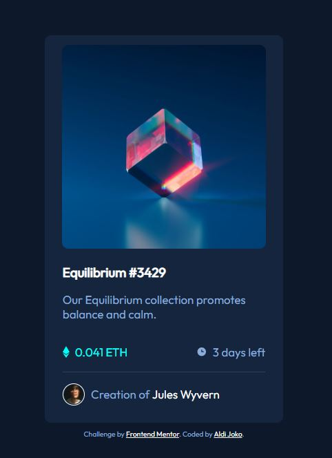

# Frontend Mentor - NFT preview card component solution

This is a solution to the [NFT preview card component challenge on Frontend Mentor](https://www.frontendmentor.io/challenges/nft-preview-card-component-SbdUL_w0U). Frontend Mentor challenges help you improve your coding skills by building realistic projects. 

## Table of contents

- [Overview](#overview)
  - [The challenge](#the-challenge)
  - [Screenshot](#screenshot)
  - [Links](#links)
- [My process](#my-process)
  - [Built with](#built-with)
  - [What I learned](#what-i-learned)
  - [Continued development](#continued-development)
  - [Useful resources](#useful-resources)
- [Author](#author)


## Overview

### The challenge

Users should be able to:

- View the optimal layout depending on their device's screen size
- See hover states for interactive elements

### Screenshot




### Links

- Solution URL: [Add solution URL here](https://github.com/aldijoko/nft-preview-card-component-main)
- Live Site URL: [Add live site URL here](https://aldijoko.github.io/nft-preview-card-component-main/)

## My process

### Built with

- HTML
- CSS 
- Flexbox


### What I learned

I learned about how to setting display using flex and more understand how to using flex, hover for change the target color when pointer going to selected target and make transparent, and how to use position relative and absolut for the content. 

To see how you can add code snippets, see below:

```css
.nft-image:hover .overlay{
    opacity: 0.5;
}

.overlay {
    position: absolute;
  display: flex;
  justify-content: center;
  align-items: center;
  height: 100%;
  width: 90%;
  opacity: 0;
  transition: .3s ease;
  background: hsl(178, 100%, 50%);
  border-radius: 10px;
}

.nft-image {
    display: flex;
    justify-content: center;
    margin-bottom: 10px;
    position: relative;
    cursor: pointer;
}


```


### Continued development

For the future project, i can understand when to use one of the css functions properly


### Useful resources

- [Overlay Image](https://www.w3schools.com/howto/howto_css_image_overlay.asp) - This helped me for create hover view and understand how to use position absolute and relative.
- [Transparent Image](https://www.w3schools.com/css/css_image_transparency.asp) - This helped me for create image opacity
- [Gap Property](https://www.w3schools.com/cssref/css3_pr_gap.asp) - This helped me for making space between 2 content in the same line.

**Note: Delete this note and replace the list above with resources that helped you during the challenge. These could come in handy for anyone viewing your solution or for yourself when you look back on this project in the future.**

## Author

<!-- - Website - [Add your name here](https://www.your-site.com) -->
- Frontend Mentor - [@aldijoko](https://www.frontendmentor.io/profile/aldijoko)
- Twitter - [@aldijokosp](https://www.twitter.com/aldijokosp)


